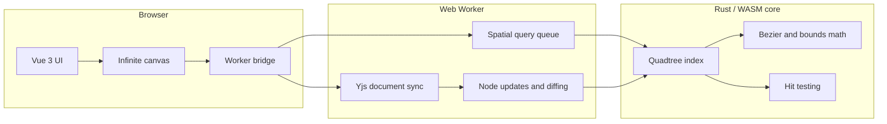
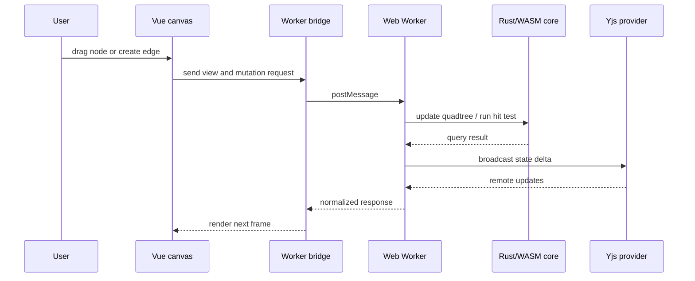

# Collaborative Node Editor

Real-time collaborative node editor built with Vue 3, TypeScript, Yjs, Web Workers, and a Rust/WASM spatial engine.

> Status: this project is still under active development. The current codebase is a working prototype, not a finished product.

## Overview

The app is designed around a split runtime:

- Vue handles the interface, canvas interactions, and rendering.
- A Web Worker absorbs expensive work so the main thread stays responsive.
- Rust/WASM provides spatial indexing, hit testing, and geometry helpers.
- Yjs keeps collaborative state synchronized across clients.

The goal is to keep the editor interactive while the scene grows in size and complexity.

## Architecture



## Interaction Flow



## What Is Implemented

- Infinite canvas with pan and zoom.
- Node rendering and draggable interactions.
- Bundled SVG edge rendering.
- Worker-backed spatial queries.
- Rust/WASM quadtree and geometry helpers.
- Yjs-based collaborative state plumbing.

## Repository Layout

| Path | Purpose |
| --- | --- |
| [src/App.vue](src/App.vue) | Application shell |
| [src/main.ts](src/main.ts) | Vue bootstrap |
| [src/components/Canvas.vue](src/components/Canvas.vue) | Main canvas surface |
| [src/components/Node.vue](src/components/Node.vue) | Node card UI |
| [src/components/EdgeConnections.vue](src/components/EdgeConnections.vue) | Bundled edge paths |
| [src/composables/useCanvasTransform.ts](src/composables/useCanvasTransform.ts) | Pan, zoom, and viewport math |
| [src/composables/useYjsCollaboration.ts](src/composables/useYjsCollaboration.ts) | Yjs document and presence handling |
| [src/workers/bridge.ts](src/workers/bridge.ts) | Main-thread worker API |
| [src/workers/synapse.worker.ts](src/workers/synapse.worker.ts) | Worker runtime |
| [crates/synapse-core](crates/synapse-core) | Rust/WASM engine |

## Running Locally

### Prerequisites

- Node.js 18 or newer.
- Rust toolchain with the `wasm32-unknown-unknown` target.
- `wasm-pack` for building the Rust crate.

### Install

```bash
npm install
```

### Build the WASM crate

```bash
npm run build:wasm
```

### Start development mode

```bash
npm run dev
```

The Vite dev server runs on `http://localhost:5173/`.

### Production build

```bash
npm run build
```

## Notes on the Current State

- The project is intentionally not production ready yet.
- APIs, file structure, and internal data flow may still change.
- Some integrations are present as scaffolding and will need hardening before release.
- The README is meant to showcase the architecture, not imply feature completeness.

## Development Focus

- Reduce main-thread work during large graph interactions.
- Keep collaboration latency low as the scene grows.
- Stabilize the Rust/WASM build pipeline for production use.
- Tighten editor UX and error handling before release.

## License

This repository does not currently declare a license in this README. Add one when the project is ready for public distribution.
